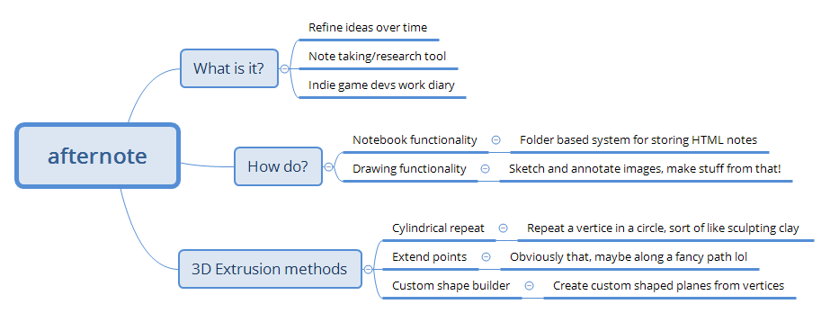

# afternote

## About
A desktop (and hopefully mobile) app that can use file or Google Drive based storage.

This is my own spin on a note taking application with cloud sync features. If it works well, I might add some diagramming and drawing features for brainstorms, UI mockups, ERD/DFD/UML, SPF30+, etc.

## Planned features (in development order)
- Import from Evernotes' export.
- Sync to cloud using Google Drive API, https://developers.google.com/drive/v3/web/appdata
- Desktop application using Electron, https://electron.atom.io/
- Markdown and Image embedding support, live WYSIWYG and code editing
- Mobile application pending research (suggest me a framework!)

## Brainstorm (23/5/2017)
So after a bit of reflection on my own needs.. I did a brainstorm and decide that afternote needs more indie game dev support abilities.. so I'm working towards that end. 

## Screenshots and Mockups
#### Screenshot - First ever

#### Mockup - Small Window - Expanded

#### Mockup - Small Window - Collapsed

#### Mockup - Large Window

